# Recurrent Neural Networks, Time Series, And Sequence Data

## Code Outline (Note: First go through all the theory):

---

## Theory section

---

  

> The sequence imposes an explicit order on the observations. The order is important. It must be respected in the formulation of prediction problems that use the sequence data as input or output for the model.

- Sequence Prediction

  - Predicting the next value for a given input sequence is what sequence prediction is all about.
  - For example:
    - Given: 1, 2, 3, 4, 5
    - Predict: 6

- Examples of Sequence Data:
  - protein sequence
  - gene sequence

---

  

> Most commonly, a time series is a sequence taken at successive equally spaced points in time. As a result, it is a series of discrete-time data. Time series examples include ocean tide heights, sunspot counts, and so on.

- Generally, time series is represented as NxDxT where N is batch, D features, and T is timesteps.
- As an example Suppose we want to model the path X takes to get to the library.

  - One sample would be X's single trip to library
  - D = 2: as the GPS will record (latitude, longitude) pairs
  - T: The number of (lat, Ing) measurements taken from start to finish of a single trip E.g. trip is 30 minutes, coordinates are measured every second
  - Coding example in RNNShapes.ipynb

- Characteristics of time series

  ### 1. Autocorrelation

  - Informally, autocorrelation is the similarity between observations as a function of the time lag between them.

  - 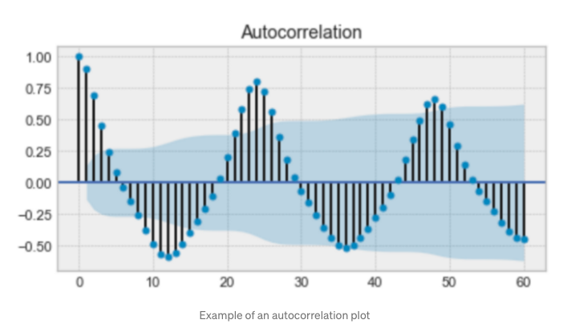

  (autocorrelation) Image source towardsdatascience.com

  ### 2. Seasonality

  - Seasonality refers to periodic fluctuations.

  - 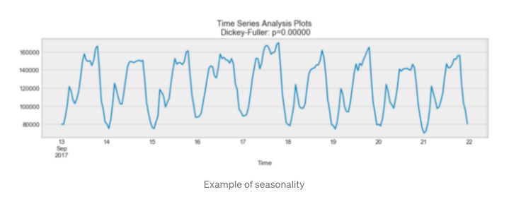

  (Seasonality) Image source towardsdatascience.com

  - If the autocorrelation plot has a sinusoidal pattern, seasonality can also be deduced. Simply looking at the time will give you the duration of the season.

  ### 3. Stationarity

  - If the statistical properties of a time series do not change over time, it is said to be stationary. In other words, the mean and variance are constant, and the covariance is independent of time.

  - 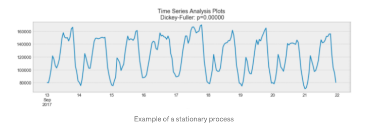

  (Stationarity) Image source towardsdatascience.com

  - In an ideal world, we will have a stationary time series for modeling. Of course, not all of them are stationary, but we can perform various transformations to make them so.

- Modelling time series

  > There are several methods for modeling a time series in order to make predictions. In this section, I will present:

  ### 1. Moving average

  - The next observation is simply the mean of all previous observations, according to this model.

  - 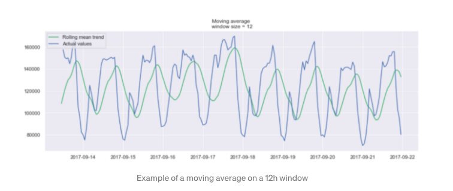

  (Moving average) Image source towardsdatascience.com

  ### 2. Exponential smoothing

  - Exponential smoothing employs a similar logic to moving average, but each observation is given a different decreasing weight. In other words, as we step away from the present, observations become less relevant.

  - 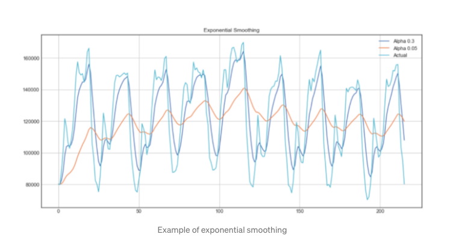

  (Exponential smoothing) Image source towardsdatascience.com

  ### 3. Seasonal autoregressive integraded moving average model (SARIMA)

  - SARIMA is a dynamic model that can model time series with non-stationary properties and seasonality by combining simpler models.

  - Second, there is the autoregression model AR (p). This is essentially a time series regression onto itself. In this case, we conclude that the current value is influenced by previous values with some lag. It needs a parameter p, which represents the maximum amount of latency. To find it, we examine the partial autocorrelation plot and locate the lag after which the majority of lags are not relevant.

  - 

  (Partial autocorrelation) Image source towardsdatascience.com

  - The moving average model MA is then applied (q). This requires a parameter q, which represents the largest lag, after which other lags on the autocorrelation plot are not important.

  - 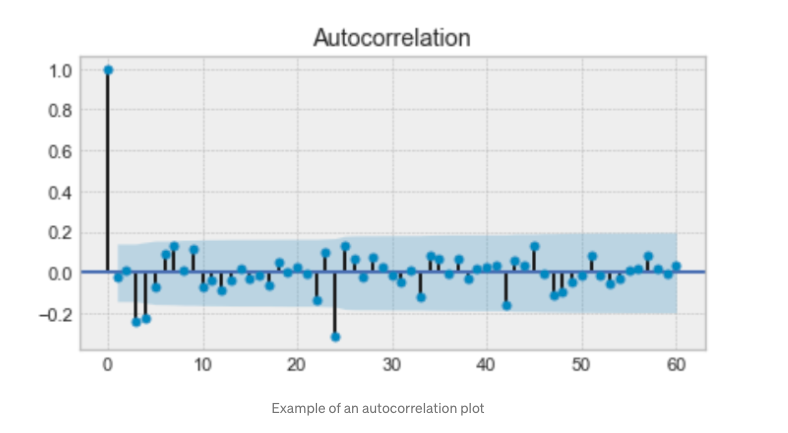

  (Autocorrelation) Image source towardsdatascience.com

  - Following that, we add the order of integration I. (d). The number of differences needed to render the series stationary is represented by the parameter d.

  - Finally, we include seasonality S(P, D, Q, s), where s is simply the duration of the season.

  - When we add them all together, we get the SARIMA(p, d, q)(P, D, Q, s) model. The key takeaway is that before modeling with SARIMA, we must transform our time series to eliminate seasonality and any non-stationary behaviors.

- You can read about Time series in details on provided links:

  - [The Complete Guide to Time Series Analysis and Forecasting on TDS](https://towardsdatascience.com/the-complete-guide-to-time-series-analysis-and-forecasting-70d476bfe775)

  - [Recurrent Neural Networks cheatsheetBy Afshine Amidi and Shervine Amidi](https://stanford.edu/~shervine/teaching/cs-230/cheatsheet-recurrent-neural-networks)

---

  

> Recurrent neural networks, or RNNs, are a form of neural network that allows previous outputs to be used as inputs while maintaining hidden states.

The Below image shows simple neural network

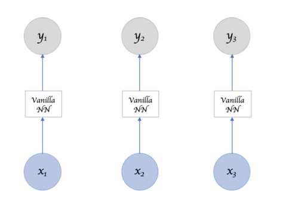

Image source towardsdatascience.com

The Below image shows Recurrent neural network

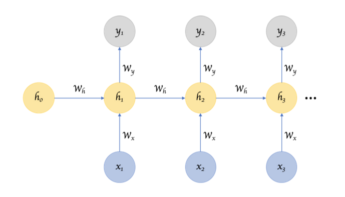

Image source towardsdatascience.com

- Advantages of RNN

  - The ability to process the input of any length
  - The model's size does not increase with the size of the input
  - Weights are shared over time.

- How RNNs learn?

  - Recurrent Neural Network remembers the past and bases its decisions on what it has learned from the past. Notice that basic feed-forward networks "know" information as well, but only what they learn during training.
  - While RNNs learn similarly during training, they often remember what they learned from prior input(s) while producing output (s). It is a part of the network. RNNs can take one or more input vectors and generate one or more output vectors, with the output(s) influenced not only by weights applied to the inputs, as in a typical NN but also by a "hidden" state vector representing the background based on prior input(s)/output(s). As a result, depending on the previous inputs in the sequence, the same input may generate different output.

- Deep RNNs

  - Is it possible to render an RNN "deep" and achieve the multi-level abstractions and representations gained by "depth" in a typical neural network?

  - Here are four ideas for adding depth:

    1. The most obvious is to add hidden states on top of one another, feeding the output of one to the next.

    2. We can also add nonlinear hidden layers between the input and hidden states.

    3. We can deepen the hidden-to-hidden transition.

    4. We can deepen the hidden-to-output transition.

    [This paper](https://arxiv.org/pdf/1312.6026.pdf) by Pascanu et al. investigates this in-depth and establishes that deep RNNs outperform shallow RNNs.

- Bidirectional RNNs

  - It is not only enough to learn from the past to foresee the future; we must also look into the future to correct the past.

  - 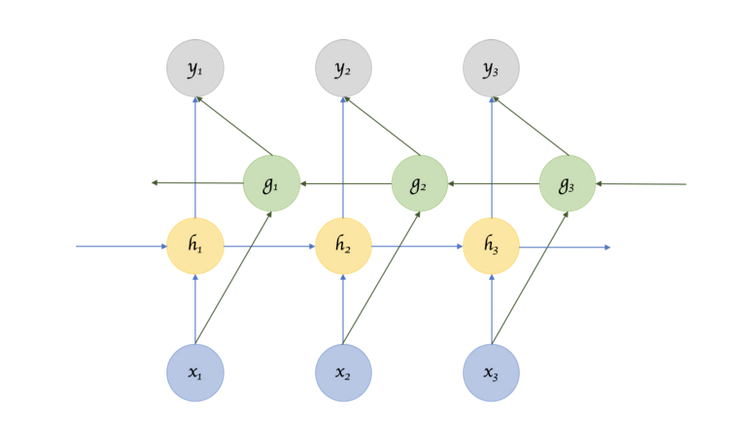

  (Bidirectional RNN) Image source towardsdatascience.com

  - This raises the inevitable question of how far into the future we should look, because if we have to wait for all inputs, the whole operation will become expensive.

- Recursive Neural Networks:

  - A recurrent neural network sequentially parses the inputs. A recursive neural network is similar in that transitions are applied to inputs repeatedly, but not necessarily sequentially.

  - 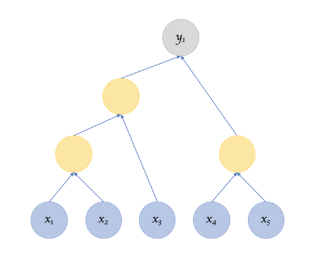

  (Recursive Neural Network) Image source towardsdatascience.com

  - **Recursive Neural Networks are a subset of Recurrent Neural Networks.** It is capable of operating on any hierarchical tree structure. Creating a tree-like structure by parsing through input nodes, merging child nodes into parent nodes, and combining them with other child/parent nodes. Recurrent Neural Networks perform the same function, but their structure is purely linear. Weights are added to the first input node, followed by the second, third, and so on.

  - If the structure is set, as in Recurrent Neural Networks, then the training, backpropagation, and other processes make sense because they are identical to a normal neural network. But, if the structure isn't set, is that also learned?

- RNN Architectures:

  - 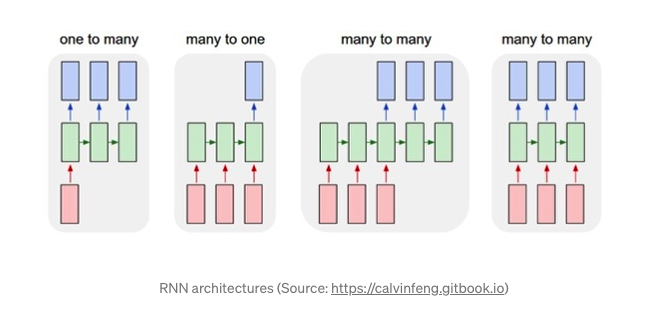

  1. One to Many Architecture: One good example of this architecture is image captioning. It takes one image and then produces a series of words in image captioning. There is just one input but several outputs in this case.

  2. Many to One Architecture: One clear example of this architecture is sentiment grouping. A sentence is categorized as positive or negative in sentiment classification. The input in this case is a string of words, and the output is a binary description.

  3. Many to Many Architecture:

  - The first type is when the input length equals to the output length.
  - The second type of many to many architecture is when input length does not equal to the output length.

- Encoder Decoder Sequence to Sequence RNNs:

  - Encoder Decoder or Sequence to Sequence RNNs are widely used in translation services. The basic idea is that there are two RNNs, one of which is an encoder that constantly updates its hidden state and generates a single “Context” output. This is then fed into the decoder, which translates the context into a sequence of outputs. Another significant difference in this arrangement is that the lengths of the input and output sequences do not have to be the same.

  - 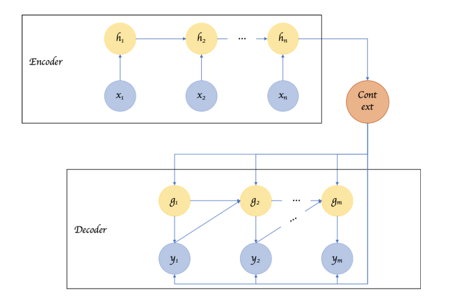

  (Encoder Decoder) Image source towardsdatascience.com

  

### Recurrent Neural Networks suffer from short-term memory. They'll have a hard time carrying information from earlier time steps to later ones if the series is long enough. If you're trying to predict something from a paragraph of text, RNNs can leave out important information at the start.

### LSTM ’s and GRU’s were created as the solution to short-term memory. They have internal mechanisms called gates that can regulate the flow of information.

(LSTM and GRU) Image source towardsdatascience.com

- These gates will figure out which data in a series should be kept and which should be discarded. It can then transfer relevant knowledge down the long chain of sequences to make predictions as a result of this. These two networks are responsible for nearly all state-of-the-art recurrent neural network performance.

* LSTMs

  - Traditional RNNs are ineffective at capturing long-term dependencies. This is primarily due to the vanishing gradient problem. Gradients or derivatives decrease exponentially when they spread down the layers while training very deep networks. This is referred to as the Vanishing Gradient Problem. These gradients are used to change the neural network weights. When the gradients disappear, the weights are not changed. It can sometimes absolutely stop the neural network from practicing. This vanishing gradient issue is popular in very deep neural networks.

  - Long Short-Term Memory was developed by Sepp Hochreiter and Juergen Schmidhuber to address the vanishing gradient problem in RNNs. The LSTM hidden layer is a variation on the RNN hidden layer. RNNs can now recall their inputs over long periods thanks to LSTM. A cell state, in addition to the hidden state, is moved to the next time stage in LSTM.

  - 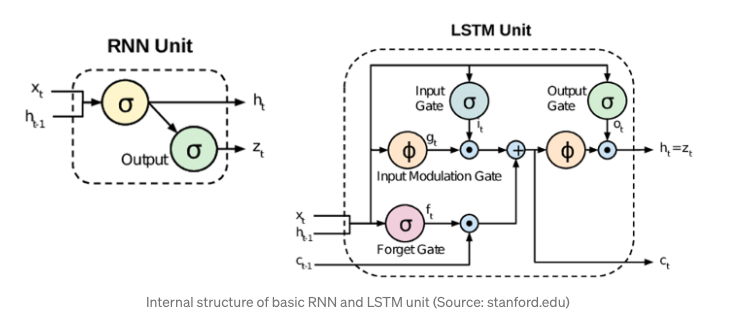

  - Long-term dependencies can be captured by LSTM. It can remember previous inputs for extended periods. An LSTM cell has three gates. These gates are used in LSTM memory manipulation. Long short-term memory (LSTM) employs gates to monitor gradient propagation in the memory of a recurrent network.

    - Forget Gate: The forget gate eliminates information from the cell that is no longer useful.
    - Input Gate: The input gate adds additional useful details to the cell state.
    - Output Gate: The output gate adds additional useful knowledge to the cell state.

  - [This post](https://colah.github.io/posts/2015-08-Understanding-LSTMs/) provides an excellent introduction to LSTMS. In a vanilla RNN, the input and the hidden state are simply passed through a single tanh layer.  LSTM (Long Short Term Memory) networks build on this basic transformation by introducing additional gates and a cell state, addressing the fundamental problem of maintaining or resetting context through sentences and regardless of the gap between such context resets. GRUs are LSTM variants that use the gates in various ways to solve the issue of long-term dependencies.

* You can read about RNNs in details on provided links:

  - [Recurrent Neural Networks, E. Scornet](https://erwanscornet.github.io/teaching/RNN.pdf)

  - [Recurrent Neural Networks on TDS](https://towardsdatascience.com/recurrent-neural-networks-d4642c9bc7ce)

  - [Recurrent Neural Networks cheatsheetBy Afshine Amidi and Shervine Amidi](https://stanford.edu/~shervine/teaching/cs-230/cheatsheet-recurrent-neural-networks)

* You can read about "LSTM and GRU" in details on provided links:

  - [Illustrated Guide to LSTM’s and GRU’s: A step by step explanation on TDS](https://towardsdatascience.com/illustrated-guide-to-lstms-and-gru-s-a-step-by-step-explanation-44e9eb85bf21)
